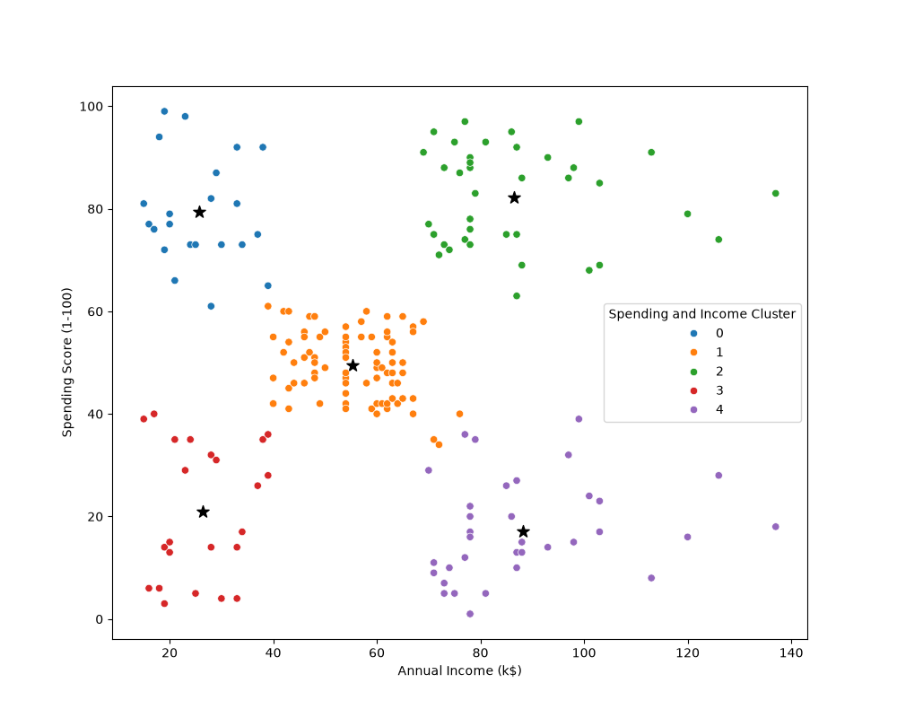

# 🛍️ Mall Customer Segmentation using K-Means Clustering


An end-to-end unsupervised machine learning project designed to identify distinct customer personas based on annual income, age, and mall spending scores to guide targeted marketing strategies.

---

## 📊 Cluster Analysis & Segments



---

## 🎯 Business Problem & Objectives

* **Business Challenge:** Understand customer demographics and purchasing behaviors to assist the marketing team in designing tailored, cost-effective campaigns.
* **Goal:** Perform market segmentation using clustering algorithms to discover natural groups of shoppers and assign actionable labels to each segment.
* **Methodology Pipeline:**
  1. **Exploratory Data Analysis (EDA):** Analyze distributions and correlations across demographic features (Age, Income, Spending Score, Gender).
  2. **Feature Engineering & Selection:** Scale and select optimal variable combinations for clustering.
  3. **K-Means Clustering:** Determine optimal cluster counts ($k$) using the Elbow Method and fit the model.
  4. **Persona Profiling & Interpretation:** Extract summary statistics per cluster and translate metrics into business actions.

---

## 💡 Key Findings & Marketing Recommendations

| Cluster | Profile | Spending Behavior | Actionable Strategy |
| :---: | :--- | :--- | :--- |
| **Cluster 2 (Target)** | High Income, High Spending Score | Premium / Loyal Shoppers | **Primary Target Group.** 54% are women; launch VIP loyalty campaigns and promote premium/popular collections. |
| **Cluster 0** | Low Income, High Spending Score | Carefree / Trend Seekers | Target with seasonal sales events, discount promotions, and high-turnover trending items. |
| **Cluster 1** | Moderate Income, Moderate Spending | Average Shoppers | Standard promotional engagement via newsletters and routine discount alerts. |
| **Cluster 3** | Low Income, Low Spending Score | Sensible Shoppers | Budget-friendly recommendations and essential utility product campaigns. |
| **Cluster 4** | High Income, Low Spending Score | Cautious / Savers | Retention campaigns focusing on value proposition, exclusive memberships, and premium financing. |

---

## 🛠️ Tech Stack

* **Language:** Python 3.9+
* **Data Manipulation:** Pandas, NumPy
* **Data Visualization:** Seaborn, Matplotlib
* **Machine Learning:** Scikit-Learn (`KMeans`, `Inertia / Elbow Method`)

---

## ⚙️ Model Execution & Clustering Logic

### 1. Bivariate Clustering (Income vs. Spending Score)

```python
import pandas as pd
from sklearn.cluster import KMeans
import matplotlib.pyplot as plt
import seaborn as sns

# Load dataset
df = pd.read_csv('data/Mall_Customers.csv')

# Fit K-Means on Annual Income and Spending Score
clustering_bivar = KMeans(n_clusters=5, init='k-means++', random_state=42, n_init=10)
df['Spending and Income Cluster'] = clustering_bivar.fit_predict(df[['Annual Income (k$)', 'Spending Score (1-100)']])

# Extract centroids
centers = pd.DataFrame(clustering_bivar.cluster_centers_, columns=['x', 'y'])

# Plot results
plt.figure(figsize=(10, 8))
sns.scatterplot(
    data=df, 
    x='Annual Income (k$)', 
    y='Spending Score (1-100)', 
    hue='Spending and Income Cluster', 
    palette='tab10'
)

📁 Repository Structure
data/Mall_Customers.csv: Dataset containing customer IDs, gender, age, annual income, and spending scores.

notebooks/customer_segmentation.ipynb: Jupyter notebook covering univariate, bivariate, and multivariate clustering pipelines.

images/Clusters_bivariate.png: Visualization of the 5 customer segments with cluster centroids.

requirements.txt: Python package dependencies.
plt.scatter(x=centers['x'], y=centers['y'], s=150, c='black', marker='*', label='Centroids')
plt.legend()
plt.show()
